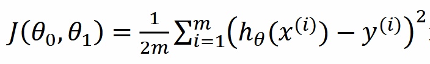

## 使用latex语法编写下面这行公式

## 在markdown文件中书写公式需要使用"$$"符号包裹公式
## 公式书写如下(''单引号是为了使公式能显示出来）：
'$$J(\theta_{0}，\theta_{1})= \frac{1}{2m}\sum_{i=1}^{m}(h_\theta(x^{i})-y^{i})^{2} $$'
## 公式展示如下：
$$J(\theta_{0}，\theta_{1})= \frac{1}{2m}\sum_{i=1}^{m}(h_\theta(x^{i})-y^{i})^{2} $$
